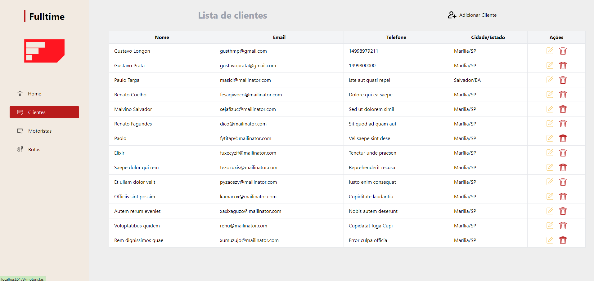

# Projeto Fulltime

- Gustavo Longon, RA: 1961693
- Gustavo Prata, RA: 1961719
- Paulo Ricardo, RA: 1977908

Desenvolvemos um sistema com um dashboard e uma página de cadastro de clientes que possui um CRUD completo. O sistema permite listar, adicionar, alterar e deletar clientes, e consome uma API que criamos utilizando ASP.NET Core e SQL Server. Todo o sistema está funcionando corretamente e os dados estão sendo armazenados de forma adequada.

## Formulário para adicionar os clientes

O formulário conta com a integração da API Postmon (https://api.postmon.com.br) para trazer os dados dos endereços e facilitar a experiência do usuário.

Confirmação do cadastro, utilizamos a biblioteca sweetalert2, para interação com o usuário e demonstrar um visual agradavel ao ter sucesso no cadastro.

## Formulário para editar os clientes

Ao clicar em editar, o usuário visualiza o formulário já preenchido com os dados atuais, facilitando o entendimento sobre o que é necessário altera.

## Confirmação para deletar o cliente

Antes de realizar a ação, é exibido um modal com a confirmação se realmente deseja apagar o cliente, uma vez que deletando não tem mais volta, o cliente é excluido permanentemente.

## Listagem sem conteúdo

Quando não haver dados de clientes ou motoristas no sistema, criamos uma ilustração para alertar que ainda não contém conteúdo no sistema.

