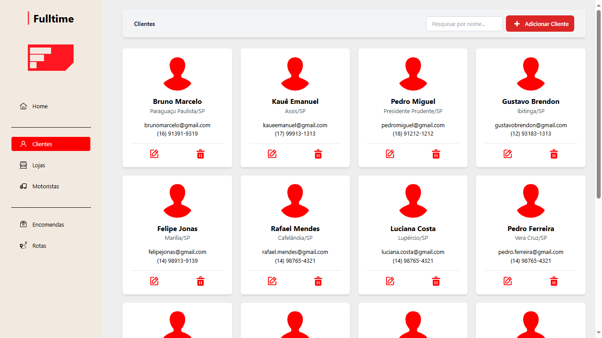

# Projeto Fulltime

- Gustavo Longon, RA: 1961693
- Gustavo Prata, RA: 1961719
- Paulo Ricardo, RA: 1977908

---

# Sistema de Gerenciamento de Rotas

Desenvolvemos um sistema completo de gerenciamento de rotas, que inclui um dashboard e várias páginas de cadastro para diferentes entidades. O sistema oferece um CRUD completo para clientes, lojas, motoristas, encomendas e rotas. As funcionalidades incluem:

- **Dashboard**: Uma visão geral do sistema com métricas e informações importantes.
- **Página de Clientes**: Permite listar, buscar, adicionar, alterar e deletar clientes.
- **Página de Lojas**: Permite listar, adicionar, buscar, alterar e deletar lojas.
- **Página de Motoristas**: Permite listar, buscar, adicionar, alterar e deletar motoristas.
- **Página de Encomendas**: Gerenciamento de encomendas, cadastro e edição.
- **Página de Rotas**: Geração e administração de rotas.

O sistema consome uma API que foi desenvolvida utilizando ASP.NET Core e SQL Server, garantindo que todos os dados sejam armazenados de forma adequada e segura. Todo o sistema está funcionando corretamente, proporcionando uma experiência eficiente e integrada para o gerenciamento de rotas.

## Funcionalidades Adicionais

- **Busca Automática de Endereço**: Implementação utilizando a API do Postman para buscar automaticamente o endereço ao inserir o CEP.
- **Sistema de Notificações**: Utilização do SweetAlert2 para notificações amigáveis e interativas para o usuário.
- **Verificações e Formatações**: 
  - Verificação e formatação de CPF verdadeiro.
  - Verificação de celular e email.
  - Entre diversas outras.
- **Sistema de Rotas**: Integração com a API do Here para puxar dados de rotas, oferecendo as melhores opções de trajetos.
- **Mais uma diversidade de funcões tudo configurada e funcionando...**

## Dashboard


<table>
  <tr>
    <td align="center"></td>
    <td align="center"></td>
    <td align="center"></td>
  </tr>
  <tr>
    <td align="center">Cards: Informações de quantos dados estão cadastrados em cada área.</td>
    <td align="center">Botão Adicionar Todos: Upload de arquivo para salvamento rápido e automático no banco de dados.</td>
    <td align="center">Botão Apagar Todos: Reseta o banco e deleta tudo automaticamente.</td>
  </tr>
</table>

## Clientes



## Lojas


## Motoristas


## Funcionalidades - (Clientes, Lojas e Motoristas) 

<table>
  <tr>
    <td align="center"></td>
  </tr>
  <tr>
    <td align="center">Adicionar: Abre um modal para a inserção das informações de cadastro, com verificações abrangentes, desde o nome até o celular, CPF, CEP (que preenche automaticamente o endereço), entre outros dados.</td>
  </tr>
</table>
<table>
  <tr>
    <td align="center"></td>
  </tr>
  <tr>
    <td align="center">Editar: Recupera automaticamente as informações do banco de dados para uma edição mais rápida, sem precisar ficar digitando um por um.</td>
  </tr>
</table>
<table>
  <tr>
    <td align="center"></td>
    <td align="center"></td>
  </tr>
  <tr>
    <td align="center">Pesquisar: Permite a busca pelo nome do cliente, motorista ou loja, exibindo o correspondente em primeiro.</td>
    <td align="center">Excluir: Remove o cliente, motorista ou loja, correspondente do card.</td>
  </tr>
</table>

## Encomendas


<table>
  <tr>
    <td align="center"></td>
  </tr>
  <tr>
    <td align="center">Adicionar: Abre um modal para a inserção das informações de cadastro da encomenda, obtendo os dados diretamente do banco de dados e fornecendo as opções em formato de seleção.</td>
  </tr>
</table>
<table>
  <tr>
    <td align="center"></td>
  </tr>
  <tr>
    <td align="center">Editar: Recupera automaticamente as informações do banco de dados para uma edição mais rápida, sem precisar ficar digitando um por um.</td>
  </tr>
</table>

## Rotas


<table>
  <tr>
    <td align="center"></td>
  </tr>
  <tr>
    <td align="center">Mapa: Exibe todas as rotas cadastradas ordenadas pelo menor tempo, apresenta todas as rotas disponíveis e inclui um botão para redefinir o zoom para o padrão.</td>
  </tr>
</table>
<table>
  <tr>
    <td align="center"></td>
  </tr>
  <tr>
    <td align="center">Adicionar: Abre um modal para a inserção das informações de cadastro da rota, obtendo os dados diretamente do banco de dados e fornecendo as opções em formato de seleção com inúmeras verificações.</td>
  </tr>
</table>
<table>
  <tr>
    <td align="center"></td>
  </tr>
  <tr>
    <td align="center">Editar: Recupera automaticamente as informações do banco de dados para uma edição mais rápida, sem precisar ficar digitando um por um.</td>
  </tr>
</table>
<table>
  <tr>
    <td align="center"></td>
  </tr>
  <tr>
    <td align="center">Detalhes: Mostram todas as informações da rota, incluindo o motorista, a loja, o trajeto das encomendas, os clientes, horários e outros detalhes relevantes.</td>
  </tr>
</table>

## SQL Server

<table>
  <tr>
    <td></td>
  </tr>
  <tr>
    <td align="center">Banco de dados - clientes, lojas, motoristas, encomendas e rotas.</td>
  </tr>
</table>
<table>
  <tr>
    <td></td>
  </tr>
  <tr>
    <td align="center">Swagger - Get, Post, Put, Delete...</td>
  </tr>
</table>

## Como Executar o Projeto

1. Clone o repositório:

   ```sh
   git clone https://github.com/GustavoPrata/projeto-fulltimev4.git
   cd seu-repositorio

3. Configure o backend:

    Certifique-se de ter o .NET Core SDK instalado.
    Navegue até a pasta do backend e configure as conexões do banco de dados no appsettings.json.

4. Execute o backend:

   ```sh
   dotnet run
   ```
   Ou execute abrindo a pasta back-end no Visual Studio e dando F5

5. Instale as dependências do frontend:

   ```sh
   npm install

5. Execute o frontend:

   ```sh
   npm run dev

## Licença

Este projeto está licenciado sob a Licença MIT - veja o arquivo LICENSE.md para mais detalhes.

